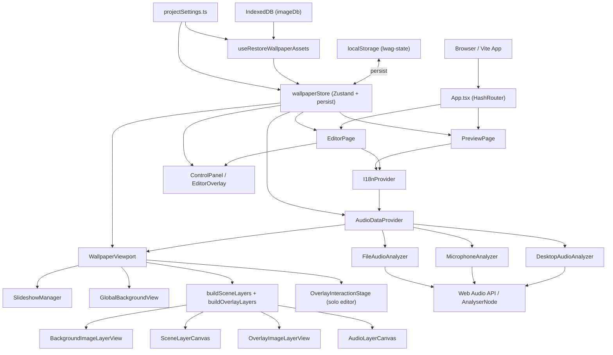

# Guia Tecnica de LiveWallpaperAnimeGlitch

Este documento explica el proyecto **como sistema**, no solo como lista de archivos.
La idea es que puedas:

1. entender la arquitectura actual,
2. ubicar rapido donde vive cada feature,
3. explicarselo a otra persona,
4. y saber por donde estudiar el repo sin perderte.

Tambien esta orientado a entender el proyecto **despues del refactor incremental**:

- separacion `editor / preview`,
- sistema de layers,
- wallpapers por imagen con slideshow,
- overlays persistentes,
- BG global,
- export/import de settings,
- perfiles guardables de `logo` y `spectrum`.

---

## 1. Diagrama de arquitectura de alto nivel

### 1.1 Vista general en Mermaid



### 1.2 Vista tipo arbol

```text
App
├── Routing
│   ├── /editor -> EditorPage
│   └── /preview -> PreviewPage
├── Providers
│   ├── I18nProvider
│   └── AudioDataProvider
├── Global state
│   └── wallpaperStore (Zustand)
├── Render pipeline
│   ├── GlobalBackgroundView
│   ├── BackgroundImageLayerView -> ImageLayerCanvas
│   ├── SceneLayerCanvas -> R3F / Three
│   │   ├── ParticleField
│   │   └── RainLayer
│   ├── OverlayImageLayerView
│   └── AudioLayerCanvas
│       ├── ReactiveLogo
│       └── CircularSpectrum
├── Editor UI
│   ├── ControlPanel
│   ├── EditorOverlay
│   └── tabs/*
├── Asset persistence
│   ├── localStorage -> config
│   └── IndexedDB -> imagenes/logo/overlays/BG global
└── Import / export
    ├── ExportTab
    └── projectSettings.ts
```

---

## 2. Explicacion de cada modulo principal y como se conectan

## 2.1 Entrada y rutas

### `src/main.tsx`

- Entry point de React.
- Monta `App`.

### `src/App.tsx`

- Usa `HashRouter`.
- Define tres rutas efectivas:
    - `#/`
    - `#/editor`
    - `#/preview`

### `src/pages/EditorPage.tsx`

- Monta:
    - `I18nProvider`
    - `AudioDataProvider`
    - `WallpaperViewport editorMode`
    - `ControlPanel`
- Tambien recalcula `isPresetDirty` escuchando cambios del store y comparando contra el preset activo.

### `src/pages/PreviewPage.tsx`

- Monta los mismos providers y el mismo `WallpaperViewport`, pero sin panel de control.
- Escucha eventos `storage` para rehidratar estado si el editor cambia settings en otra pestaña.
- Tiene una UI minima temporal: fullscreen y volver al editor.

**Idea importante:** editor y preview comparten el mismo motor de render. La diferencia principal es la UI alrededor.

---

## 2.2 Estado global y modelo de datos

### `src/store/wallpaperStore.ts`

- Es el centro del proyecto.
- Usa `zustand` + `persist`.
- Contiene:
    - todos los settings visuales,
    - flags de audio,
    - estado del slideshow,
    - overlays,
    - presets custom,
    - slots guardados de `logo` y `spectrum`,
    - configuracion del panel,
    - orden de capas (`layerZIndices`).

### `src/types/wallpaper.ts`

- Define el modelo principal `WallpaperState`.
- Tambien define enums/tipos clave:
    - `SpectrumLayout`
    - `SpectrumShape`
    - `FilterTarget`
    - `SlideshowTransitionType`
    - `OverlayCropShape`
    - `ProfileSlot<T>`
    - `SpectrumProfileSettings`
    - `LogoProfileSettings`

### `src/lib/constants.ts`

- Declara `DEFAULT_STATE`.
- Es la base de:
    - el primer arranque,
    - resets,
    - migraciones,
    - export/import.

**Idea importante:** el store hoy funciona como un “scene document in memory”.
No solo guarda UI state; guarda la escena completa.

---

## 2.3 Sistema de layers

### `src/types/layers.ts`

- Define una capa abstracta con:
    - `id`
    - `type`
    - `kind`
    - `enabled`
    - `zIndex`
    - `position`
    - `scale`
    - `rotation`
    - `opacity`

- Divide en tres familias:
    - `scene`
    - `overlay`
    - `controller`

### `src/lib/layers.ts`

- Convierte el `WallpaperState` en arrays de layers renderizables:
    - `buildSceneLayers`
    - `buildOverlayLayers`
    - `buildControllerLayers`

**Conexion clave:**

- el store guarda estado “de usuario”,
- `lib/layers.ts` lo traduce a un modelo mas limpio para render.

Esto hace que `WallpaperViewport` no dependa de `if` gigantes sobre el raw state.

---

## 2.4 Viewport y composicion visual

### `src/components/wallpaper/WallpaperViewport.tsx`

- Es el compositor principal.
- Hace tres cosas:
    1. ejecuta `SlideshowManager`,
    2. dibuja `GlobalBackgroundView`,
    3. construye y renderiza el stack global de layers.

### Orden conceptual de render

1. `GlobalBackgroundView`
2. layers construidas desde `buildSceneLayers + buildOverlayLayers`
3. `OverlayInteractionStage` si estamos en editor

### `src/components/wallpaper/GlobalBackgroundView.tsx`

- Dibuja el **BG global fijo** en un canvas 2D propio.
- Su funcion es servir de fondo de respaldo para que nunca se vea negro cuando cambia el slideshow.
- Tiene sus propios filtros:
    - brightness
    - contrast
    - saturation
    - blur
    - hue rotate

### `src/components/wallpaper/layers/BackgroundImageLayerView.tsx`

- En el estado actual del proyecto, el wallpaper principal se renderiza por la ruta 2D:
    - `ImageLayerCanvas`
- Esto es importante porque antes convivian varias rutas de render del BG, y eso generaba bugs de filtros duplicados o invisibles.

### `src/components/wallpaper/layers/ImageLayerCanvas.tsx`

- Es una de las piezas mas complejas del repo.
- Renderiza:
    - wallpaper principal,
    - overlays de imagen con efectos avanzados.

- Tambien centraliza:
    - fit modes,
    - posicion y escala,
    - slideshow transitions,
    - RGB shift,
    - glitch,
    - film noise,
    - scanlines,
    - color filters,
    - blur,
    - crop y edge effects en overlays.

**Esta es probablemente la pieza mas “multiproposito” del proyecto.**

### `src/components/wallpaper/layers/SceneLayerCanvas.tsx`

- Renderiza capas Three.js / React Three Fiber.
- Hoy se usa para:
    - particulas,
    - lluvia.

### `src/components/wallpaper/layers/OverlayImageLayerView.tsx`

- Renderiza overlays visuales.
- Usa:
    - una imagen DOM base, mas barata y estable,
    - y opcionalmente `ImageLayerCanvas` encima si hay efectos avanzados activos.

### `src/components/wallpaper/OverlayInteractionStage.tsx`

- No dibuja el overlay real.
- Solo coloca un hitbox invisible para arrastrarlo en editor.
- Esto separa “render final” de “interaccion”.

---

## 2.5 Audio input y analisis

### `src/context/AudioDataContext.tsx`

- Es la fachada de audio del sistema.
- Expone funciones simples para el resto de la app:
    - `getAmplitude`
    - `getPeak`
    - `getBands`
    - `getFrequencyBins`
    - `startCapture`
    - `startFileCapture`
    - `stopCapture`
    - controles de MP3: pause, resume, seek, volume, loop

### `src/lib/audio/types.ts`

- Define `IAudioSourceAdapter`.
- Esto abstrae la fuente de audio real.

### Adaptadores reales

#### `src/lib/audio/DesktopAudioAnalyzer.ts`

- Captura audio del escritorio o pestaña usando `getDisplayMedia`.
- Crea `AudioContext + AnalyserNode`.
- Calcula bins, amplitud, peak y bandas.

#### `src/lib/audio/MicrophoneAnalyzer.ts`

- Captura mic usando `getUserMedia`.
- Misma idea que desktop, pero con otra fuente.

#### `src/lib/audio/FileAudioAnalyzer.ts`

- Carga un MP3 o archivo local.
- Usa `HTMLAudioElement` + `MediaElementAudioSourceNode`.
- Es el unico adaptador que tambien funciona como mini reproductor.

### `src/hooks/useAudioData.ts`

- Es solo alias de conveniencia hacia `useAudioContext`.

**Idea importante:** todo el sistema visual consume una API de audio comun, sin saber si el audio viene de escritorio, microfono o archivo.

---

## 2.6 Logo reactivo

### `src/components/audio/ReactiveLogo.ts`

- Render imperativo en canvas 2D.
- Mantiene estado interno fuera de React:
    - amplitud suavizada,
    - pico adaptativo,
    - piso adaptativo,
    - escala renderizada.

- Implementa la reactividad del logo con:
    - attack
    - release
    - peak memory
    - floor lift
    - min/max scale
    - punch transitorio

### `src/components/audio/layers/overlayLayerRegistry.ts`

- Decide como dibujar cada overlay layer.
- Para el logo:
    - calcula el drive desde bins + bandas,
    - llama `drawLogo(...)`.

**Idea importante:** el logo no es un componente React “declarativo”.
Es un renderer canvas con estado interno suavizado frame a frame.

---

## 2.7 Spectrum

### `src/components/audio/CircularSpectrum.ts`

- Render imperativo del spectrum en canvas 2D.
- Soporta:
    - layout circular y lineal,
    - shapes: bars, lines, wave, dots,
    - color modes,
    - peak hold,
    - mirror,
    - posicion libre,
    - follow logo,
    - transicion suave entre modos via snapshot/fade.

### `src/components/audio/layers/overlayLayerRegistry.ts`

- Para el spectrum:
    - ajusta `innerRadius` y posicion si sigue al logo,
    - llama `drawSpectrum(...)`.

### `src/components/audio/layers/AudioLayerCanvas.tsx`

- Canvas overlay dedicado para `logo` o `spectrum`.
- Cada layer de audio tiene su canvas propio.
- Lee audio en cada frame y dibuja usando el registry.

**Idea importante:** spectrum y logo estan en un pipeline separado del BG y de Three.js.

---

## 2.8 Particulas

### `src/components/wallpaper/ParticleField.tsx`

- Implementacion real de las particulas.
- Usa:
    - `@react-three/fiber`
    - `three`
    - shaders GLSL propios (`particleVertex.glsl`, `particleFragment.glsl`)

- Soporta:
    - shape index,
    - rainbow/gradient/solid,
    - audio reactive size/opacity,
    - glow,
    - scanlines propias,
    - rotacion y direccion,
    - limits por performance mode.

### `src/components/wallpaper/ParticlesBackground.tsx`

### `src/components/wallpaper/ParticlesForeground.tsx`

- Son wrappers para colocar el `ParticleField` atras o adelante.

**Idea importante:** aqui el render ya no es canvas 2D sino GPU/shader-based.

---

## 2.9 Lluvia

### `src/components/wallpaper/RainLayer.tsx`

- Capa R3F + shader para lluvia.
- Usa `rainVertex.glsl` y `rainOverlayFragment.glsl`.
- Tiene uniforms para:
    - intensidad
    - cantidad
    - angulo
    - velocidad
    - length / width / blur
    - tipo de particula
    - color mode
    - variacion

**Idea importante:** lluvia es otra capa shader-based, separada del BG y del canvas de audio.

---

## 2.10 Background, slideshow y filtros

### `src/components/SlideshowManager.tsx`

- No renderiza nada.
- Solo mueve el `activeImageId` cada cierto tiempo.

### `src/lib/backgroundImages.ts`

- Encapsula la logica de imagenes del wallpaper:
    - creacion,
    - defaults,
    - deteccion de layouts por defecto.

### `src/components/controls/tabs/BgTab.tsx`

- Es la UI del sistema de wallpapers.
- Hoy gestiona:
    - wallpaper activo,
    - pool de imagenes,
    - slideshow,
    - BG global,
    - “aplicar layout activo a defaults”.

### `src/components/controls/tabs/FiltersTab.tsx`

- UI para filtros dirigidos a capas de imagen.
- Tiene `filterTarget`:
    - background
    - selected overlay
    - all-images

### `src/components/controls/tabs/GlitchTab.tsx`

- UI de glitch/RGB/audio drive.
- En la practica, comparte territorio conceptual con filters, lo cual hoy sigue siendo una fuente de complejidad.

**Idea importante:** el wallpaper principal y los overlays de imagen pasan por `ImageLayerCanvas`, pero los controles de filtros y glitch estan divididos en tabs distintas. Eso explica parte de los bugs historicos.

---

## 2.11 Overlays

### `src/components/controls/tabs/OverlaysTab.tsx`

- Gestiona overlays cargados por el usuario.
- Permite:
    - subir imagenes,
    - seleccionar overlay,
    - editar zIndex,
    - scale,
    - rotation,
    - opacity,
    - blend mode,
    - crop shape,
    - edge fade / blur / glow,
    - position X/Y.

### Persistencia

- Los archivos se guardan en IndexedDB.
- El store persiste solo ids y config.
- Luego `useRestoreWallpaperAssets()` recompone los `blob:` URLs en runtime.

---

## 2.12 Persistencia

### `src/store/wallpaperStore.ts`

- Usa `persist(...)` de Zustand con clave `lwag-state`.
- Eso guarda config en `localStorage`.

### `src/lib/db/imageDb.ts`

- Usa IndexedDB para guardar binarios de imagen.
- Almacena:
    - wallpapers
    - logo
    - overlays
    - BG global

### `src/hooks/useRestoreWallpaperAssets.ts`

- Al arrancar:
    - lee ids del store,
    - recupera blobs desde IndexedDB,
    - reconstruye `blob URLs`,
    - vuelve a poblar `backgroundImages`, `logoUrl`, `overlays`, `globalBackgroundUrl`.

### `src/lib/projectSettings.ts`

- Export/import de settings JSON.
- No exporta binarios todavia.
- Reinyecta config y luego llama `restoreWallpaperAssets()`.

**Idea importante:** el proyecto separa muy claro:

- config ligera -> `localStorage`
- archivos binarios -> `IndexedDB`

---

## 2.13 Presets

### `src/lib/presets.ts`

- Define presets built-in.
- Tiene helpers para:
    - extraer preset values,
    - resolver preset,
    - detectar dirty state.

### `src/components/controls/PresetSelector.tsx`

- UI principal de presets globales.

### En el store

- `applyPreset`
- `saveCustomPreset`
- `duplicatePreset`
- `revertToActivePreset`

### Nuevo agregado del refactor

- `logoProfileSlots`
- `spectrumProfileSlots`
- Son mini perfiles locales de cada feature, distintos de los presets globales.

---

## 2.14 Editor UI

### `src/components/controls/ControlPanel.tsx`

- Panel flotante pequeño.
- Abre tabs.
- Maneja idioma, preview, reset por tab, corner del panel, FPS badge.

### `src/components/controls/EditorOverlay.tsx`

- Version expandida del editor.
- Muestra todas las secciones en grid.

### `src/components/controls/tabs/*`

- Cada tab toca un subconjunto del store.
- Esto hace que la UI este modularizada aunque el estado siga centralizado.

---

## 3. Que parte maneja cada feature

### Rutas editor/preview

- `src/App.tsx`
- `src/pages/EditorPage.tsx`
- `src/pages/PreviewPage.tsx`

### Estado global

- `src/store/wallpaperStore.ts`
- `src/types/wallpaper.ts`
- `src/lib/constants.ts`

### Persistencia

- Config: `src/store/wallpaperStore.ts` via Zustand persist
- Assets: `src/lib/db/imageDb.ts`
- Restauracion: `src/hooks/useRestoreWallpaperAssets.ts`
- Export/import: `src/lib/projectSettings.ts`

### Background / slideshow

- UI: `src/components/controls/tabs/BgTab.tsx`
- Timer/logica: `src/components/SlideshowManager.tsx`
- Render principal: `src/components/wallpaper/layers/ImageLayerCanvas.tsx`
- BG de respaldo: `src/components/wallpaper/GlobalBackgroundView.tsx`
- Helpers: `src/lib/backgroundImages.ts`

### Audio input (desktop / mic / file)

- `src/context/AudioDataContext.tsx`
- `src/lib/audio/DesktopAudioAnalyzer.ts`
- `src/lib/audio/MicrophoneAnalyzer.ts`
- `src/lib/audio/FileAudioAnalyzer.ts`
- UI: `src/components/controls/tabs/AudioTab.tsx`

### Audio analysis

- `AnalyserNode` encapsulado en los adapters
- API comun: `src/lib/audio/types.ts`
- consumo via hook: `src/hooks/useAudioData.ts`

### Spectrum

- Renderer: `src/components/audio/CircularSpectrum.ts`
- Canvas de capa: `src/components/audio/layers/AudioLayerCanvas.tsx`
- Integracion: `src/components/audio/layers/overlayLayerRegistry.ts`
- UI: `src/components/controls/tabs/SpectrumTab.tsx`

### Logo reactivo

- Renderer: `src/components/audio/ReactiveLogo.ts`
- Drive desde audio: `src/components/audio/layers/overlayLayerRegistry.ts`
- UI: `src/components/controls/tabs/LogoTab.tsx`

### Particulas

- Renderer base: `src/components/wallpaper/ParticleField.tsx`
- Wrappers: `src/components/wallpaper/ParticlesBackground.tsx`, `src/components/wallpaper/ParticlesForeground.tsx`
- UI: `src/components/controls/tabs/ParticlesTab.tsx`

### Lluvia

- Renderer: `src/components/wallpaper/RainLayer.tsx`
- UI: `src/components/controls/tabs/RainTab.tsx`

### Overlays

- UI: `src/components/controls/tabs/OverlaysTab.tsx`
- Render: `src/components/wallpaper/layers/OverlayImageLayerView.tsx`
- Interaccion: `src/components/wallpaper/OverlayInteractionStage.tsx`

### Presets

- Globales: `src/lib/presets.ts`, `src/components/controls/PresetSelector.tsx`
- Slots por feature: `src/lib/featureProfiles.ts`, `LogoTab.tsx`, `SpectrumTab.tsx`

---

## 4. Flujo completo: desde abrir la app hasta ver la visualizacion funcionando

## 4.1 Arranque

1. El navegador carga `index.html`.
2. `src/main.tsx` monta React.
3. `App.tsx` decide ruta actual con `HashRouter`.

## 4.2 Si entras al editor

4. `EditorPage` monta providers y `WallpaperViewport`.
5. `useRestoreWallpaperAssets()` reconstruye assets guardados desde IndexedDB.
6. Zustand rehidrata config desde `localStorage`.
7. El store ya contiene:
    - config visual,
    - lista de wallpapers,
    - overlay configs,
    - presets,
    - ids de assets.

## 4.3 Construccion de escena

8. `WallpaperViewport` ejecuta:
    - `SlideshowManager`
    - `GlobalBackgroundView`
    - `buildSceneLayers(state)`
    - `buildOverlayLayers(state)`
9. Esas layers se ordenan por `zIndex`.
10. Cada layer se renderiza por su pipeline:

- BG / overlays imagen -> canvas 2D / DOM
- particles / rain -> R3F + shaders
- logo / spectrum -> canvas 2D imperativo

## 4.4 Audio

11. `AudioDataProvider` espera una fuente:

- desktop
- mic
- file

12. Cuando el usuario inicia captura o MP3:

- se crea el adapter correcto,
- se construye `AnalyserNode`,
- se empiezan a exponer bins / bands / amplitude.

## 4.5 Visualizacion reactiva

13. Cada renderer consulta audio segun lo necesite:

- BG usa bass zoom / transition audio drive
- logo usa peak/bands
- spectrum usa bins
- particulas pueden usar amplitude

14. Los loops de render van actualizando visuales frame a frame.

## 4.6 Persistencia y preview

15. Los cambios del usuario se escriben en el store.
16. `persist` los guarda en `localStorage`.
17. Los assets binarios permanecen en IndexedDB.
18. Si hay una ventana `preview`, esta escucha `storage` y se rehidrata.

---

## 5. Dependencias / librerias externas importantes

## Runtime principal

### `react`

- Base de la UI.
- Se usa para providers, tabs, pages y coordinacion general.

### `react-dom`

- Montaje en navegador.

### `react-router-dom`

- Maneja `HashRouter` y separacion `editor / preview`.

### `zustand`

- Estado global.
- Se usa como documento de escena y bus central de configuracion.

### `three`

- Base 3D / shader / materiales / geometria.

### `@react-three/fiber`

- Bridge React -> Three.js.
- Se usa en `SceneLayerCanvas` para lluvia y particulas.

## Build / tooling

### `vite`

- Dev server + build.

### `@vitejs/plugin-react`

- Integracion de React con Vite.

### `typescript`

- Tipado del sistema.

### `tailwindcss` + `@tailwindcss/vite`

- Estilos del panel/editor.

### `vite-plugin-glsl`

- Permite importar `.glsl` como modulos.
- Sin esto, shaders como `particleFragment.glsl` o `rainVertex.glsl` no entrarían limpios al bundle.

## Dependencias instaladas pero hoy no obvias / no usadas activamente

### `@react-three/drei`

- Instalada, pero en el estado actual no aparece usada en `src/`.

### `framer-motion`

- Instalada, pero tampoco aparece usada en `src/`.

Esto es importante porque son candidatas claras a limpieza futura si no se van a usar.

---

## 6. Partes complejas o no obvias

## 6.1 `ImageLayerCanvas.tsx`

- Es compleja porque mezcla muchas responsabilidades:
    - background render,
    - slideshow transitions,
    - filters,
    - glitch,
    - RGB shift,
    - film noise,
    - scanlines,
    - overlay effects,
    - target logic.

Si entiendes esta pieza, entiendes buena parte del proyecto.

## 6.2 `AudioDataContext.tsx` + adapters

- La abstraccion por adapters hace que todo el render consuma audio igual sin importar la fuente.
- Muy buena idea arquitectonica.
- No es tan obvia al leer el proyecto por primera vez.

## 6.3 `lib/layers.ts`

- Parece simple, pero es clave porque es la traduccion entre:
    - estado de UI,
    - modelo de escena.

## 6.4 `CircularSpectrum.ts` y `ReactiveLogo.ts`

- No son componentes React tipicos.
- Son renderers imperativos con estado interno que vive fuera de React.
- Esto es bueno para performance, pero exige entender el flujo frame-a-frame.

## 6.5 Persistencia en dos niveles

- `localStorage` para config
- `IndexedDB` para binarios

Es una decision correcta para navegador, pero no es trivial al depurar.

## 6.6 Arquitectura hibrida

- El proyecto no usa un solo pipeline visual.
- Usa tres:
    1. DOM/CSS
    2. Canvas 2D
    3. WebGL / Three / shaders

Eso le da potencia, pero tambien lo hace mas dificil de razonar.

---

## 7. Que deberias estudiar primero para entender el sistema mas rapido

### Nivel 1: mapa mental del proyecto

1. `src/App.tsx`
2. `src/pages/EditorPage.tsx`
3. `src/components/wallpaper/WallpaperViewport.tsx`
4. `src/store/wallpaperStore.ts`

### Nivel 2: como se renderiza de verdad

5. `src/lib/layers.ts`
6. `src/components/wallpaper/layers/ImageLayerCanvas.tsx`
7. `src/components/audio/layers/AudioLayerCanvas.tsx`
8. `src/components/audio/layers/overlayLayerRegistry.ts`

### Nivel 3: audio reactivo

9. `src/context/AudioDataContext.tsx`
10. `src/lib/audio/DesktopAudioAnalyzer.ts`
11. `src/lib/audio/FileAudioAnalyzer.ts`
12. `src/components/audio/ReactiveLogo.ts`
13. `src/components/audio/CircularSpectrum.ts`

### Nivel 4: features concretas

14. `src/components/controls/tabs/BgTab.tsx`
15. `src/components/controls/tabs/AudioTab.tsx`
16. `src/components/controls/tabs/OverlaysTab.tsx`
17. `src/components/wallpaper/ParticleField.tsx`
18. `src/components/wallpaper/RainLayer.tsx`

### Nivel 5: persistencia y tooling

19. `src/hooks/useRestoreWallpaperAssets.ts`
20. `src/lib/db/imageDb.ts`
21. `src/lib/projectSettings.ts`

---

## 8. Archivos mas importantes para leer primero, en orden

1. `src/App.tsx`
2. `src/pages/EditorPage.tsx`
3. `src/components/wallpaper/WallpaperViewport.tsx`
4. `src/store/wallpaperStore.ts`
5. `src/types/wallpaper.ts`
6. `src/lib/constants.ts`
7. `src/lib/layers.ts`
8. `src/components/wallpaper/layers/ImageLayerCanvas.tsx`
9. `src/context/AudioDataContext.tsx`
10. `src/lib/audio/types.ts`
11. `src/lib/audio/DesktopAudioAnalyzer.ts`
12. `src/lib/audio/FileAudioAnalyzer.ts`
13. `src/components/audio/layers/AudioLayerCanvas.tsx`
14. `src/components/audio/layers/overlayLayerRegistry.ts`
15. `src/components/audio/ReactiveLogo.ts`
16. `src/components/audio/CircularSpectrum.ts`
17. `src/components/controls/ControlPanel.tsx`
18. `src/components/controls/tabs/BgTab.tsx`
19. `src/components/controls/tabs/AudioTab.tsx`
20. `src/components/controls/tabs/OverlaysTab.tsx`
21. `src/hooks/useRestoreWallpaperAssets.ts`
22. `src/lib/db/imageDb.ts`
23. `src/lib/projectSettings.ts`

Si quieres una lectura aun mas rapida:

- **store**
- **viewport**
- **ImageLayerCanvas**
- **AudioDataContext**
- **ReactiveLogo / CircularSpectrum**

---

## 9. Resumen simple para explicarselo a un compañero

> “LiveWallpaperAnimeGlitch es un editor de wallpapers audio-reactivos hecho para navegador.
> Tiene dos modos: editor y preview.
> Todo el estado de la escena vive en Zustand.
> Las configuraciones se guardan en localStorage y las imagenes en IndexedDB.
> El render final no sale de una sola tecnologia: usa canvas 2D para fondos y overlays con efectos, Three.js para particulas y lluvia, y otro canvas 2D para logo y spectrum.
> El audio entra desde escritorio, microfono o MP3, pero todo pasa por la misma interfaz de analisis, asi que las visuales no dependen de una fuente en particular.
> El viewport construye una lista de layers globales y las dibuja segun su z-index.
> La app ya se parece mas a un editor en tiempo real que a un demo unico de visualizer.”

---

## 10. Bugs, deudas o riesgos de diseno detectables en la arquitectura actual

## 10.1 Store demasiado grande

- `wallpaperStore.ts` concentra demasiado:
    - scene state,
    - UI state,
    - persistence glue,
    - migrations,
    - actions.

**Riesgo:** cuesta mantenerlo y es facil pisar features.

## 10.2 Duplicacion de estado en background

- Existen al mismo tiempo:
    - `imageUrl`, `imageScale`, `imagePositionX`, `imagePositionY`, `imageFitMode`
    - y tambien `backgroundImages[] + activeImageId`

Eso existe por compatibilidad y comodidad de la UI, pero conceptualmente duplica informacion.

**Riesgo:** inconsistencias entre “imagen activa derivada” y “array fuente”.

## 10.3 Multiples pipelines visuales

- DOM
- Canvas 2D
- R3F / WebGL

**Riesgo:** cuando una feature visual cambia, a veces hay que tocar mas de un pipeline.

## 10.4 `ImageLayerCanvas.tsx` esta muy cargado

- Es una pieza demasiado central.
- Si algo se rompe en filtros/glitch/transitions, suele caer ahi.

**Riesgo:** componente “god object”.

## 10.5 Restos de arquitectura anterior

Hay archivos que hoy no parecen ser la ruta principal:

- `src/components/wallpaper/WallpaperCanvas.tsx`
- `src/components/wallpaper/WallpaperScene.tsx`
- `src/components/audio/AudioOverlay.tsx`
- `src/components/wallpaper/BackgroundPlane.tsx`
- `src/components/wallpaper/layers/FxLayerCanvas.tsx`

Algunos siguen existiendo como vestigios del pipeline anterior o rutas parciales.

**Riesgo:** confunden a quien estudia el repo y pueden reintroducir bugs si se tocan sin saber.

## 10.6 Sistema de filtros y glitch todavia conceptualemente dividido

- `FiltersTab` y `GlitchTab` comparten territorio sobre capas de imagen.
- La implementacion actual funciona, pero la separacion conceptual no es perfecta.

**Riesgo:** UX ambigua y bugs por “target” o por pipeline.

## 10.7 Persistencia de assets limitada a imagenes

- `imageDb.ts` solo maneja imagenes.
- El proyecto completo portable con audio no existe todavia.

**Riesgo:** export/import aun no es un “project package” real.

## 10.8 Sync editor/preview basada en `storage`

- El preview escucha cambios de `localStorage`.

**Riesgo:** funciona bien para este caso, pero no es un sistema de colaboracion ni sync en tiempo real robusto.

## 10.9 Falta de tests

- No se ven tests unitarios ni de integracion.

**Riesgo:** muchas regresiones solo se descubren probando visualmente.

## 10.10 Algunas dependencias instaladas parecen no usarse

- `framer-motion`
- `@react-three/drei`

**Riesgo:** bundle mas grande y confusion sobre el stack real.

---

## 11. Lectura final: como entender “lo que Codex fue agregando commit por commit”

La historia tecnica del repo hoy se puede leer asi:

1. **Base inicial**: wallpaper + audio visualizer.
2. **Separacion editor/preview**: misma escena, distinta UI.
3. **Centralizacion del estado**: Zustand como documento de escena.
4. **Sistema de layers**: ya no todo cuelga de condicionales sueltos.
5. **Background por array de imagenes**: cada imagen puede tener layout propio.
6. **Slideshow mas serio**: transiciones, timing, BG global.
7. **Overlays persistentes**: assets editables por encima de la escena.
8. **Audio mas completo**: desktop / mic / file + mini player MP3.
9. **Slots guardables por feature**: `logo` y `spectrum`.
10. **Export/import JSON**: primer paso a proyectos portables.

O dicho simple:

> el proyecto paso de ser “un visualizer con panel” a “un editor de escenas audio-reactivas en navegador”.
