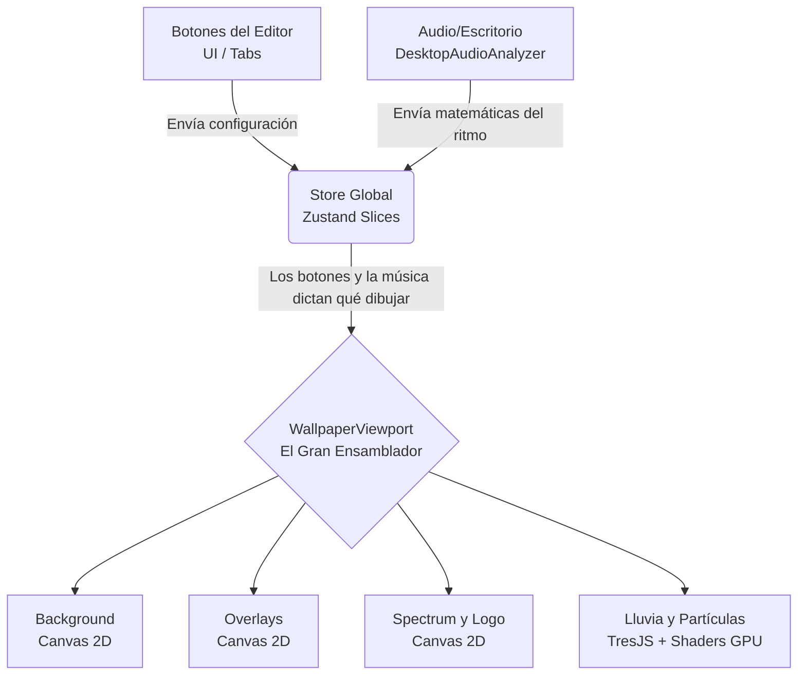

# Guía Técnica de tu Live Wallpaper (Para Humanos)

¡Hola Jefe! Si estás leyendo esto, es porque quieres recuperar el control de tu proyecto sin ahogarte en código legacy. El proyecto ha crecido un montón y está lleno de cosas chulas pero complejas (WebGL, audio en tiempo real, IndexedDB). 

Esta guía te explicará **exactamente qué hace cada cosa y en qué orden leerlo** sin usar jerga inflada.

---

## 🗺️ 1. Mapa de Carreteras: Las Carpetas Clave

Aquí tienes el mapa de la carpeta `src/`, que es donde ocurre toda la magia.

| Carpeta | ¿Para qué sirve? | Lenguaje Principal |
| :--- | :--- | :--- |
| `components/` | Las piezas visuales de Lego. Tiene la UI del editor y los lienzos (canvas) donde se dibujan las cosas. | React (`.tsx`) |
| `store/` | El "Cerebro" o Memoria a corto plazo. Guarda todo el estado activo (qué fondo está puesto, el volumen, los colores). | TypeScript + Zustand (`.ts`) |
| `shaders/` | **El motor gráfico hiper-rápido.** Aquí viven las matemáticas que dibujan las partículas de lluvia, nieve, y filtros locos directo en la tarjeta de video (GPU). | GLSL (`.glsl`) |
| `lib/` | Herramientas y adaptadores puros. Exportar archivos, analizar el audio del micrófono, leer de la base de datos. Nada de UI. | TypeScript puro (`.ts`) |
| `context/` | Enchufes globales. Exponen la data de audio y las traducciones a cualquier componente que lo pida. | React Context (`.tsx`) |
| `hooks/` | Funciones reutilizables de React para cosas como "restaurar imágenes al abrir la app". | React Hooks (`.ts`) |

### Mención Especial: ¿Qué diablos es la carpeta `shaders/`?
Un shader (`.glsl`) es un programita pequeñito escrito en un lenguaje parecido a `C` (OpenGL Shading Language).
En lugar de ejecutarse en el procesador normal (CPU), se ejecuta **en la Tarjeta de Video (GPU)** cientos de veces por segundo para miles de píxeles al mismo tiempo.
* Por eso tu lluvia (`rainOverlayFragment.glsl`) y el brillo/ruido de colores de tu anime (`rgbSplitFragment.glsl`) corren tan rápido sin congelar la app. 
* React se comunica con estos archivos mágicos usando una librería puente llamada `@react-three/fiber` y `Three.js` (ubicada en `src/components/wallpaper/`).

---

## 🏗️ 2. ¿Quién hace qué? (Arquitectura Separada)

Para no volverte loco, el proyecto divide responsabilidades de forma bastante limpia. Aquí las diferencias:

1. **UI / Editor**: (`src/components/controls/`)
   Son solo botones y sliders. No dibujan el wallpaper. Su único trabajo es decirle a la Memoria Global (Zustand): *"Hey, el usuario cambió el color a Rojo"*.
2. **Estado Global**: (`src/store/`)
   La configuración viva actual de tu escena. Se acaba de refactorizar en "slices" (rebanadas) para que no sea un archivo monstruoso. Ahora hay `audioSlice`, `backgroundSlice`, etc.
3. **Persistencia**: 
   * Lo **ligero** (nombres de presets, configuraciones de sliders) se guarda en el navegador en **localStorage** (`wallpaperStorePersistence.ts`).
   * Lo **pesado** (imágenes, audios en formato binario "Blob") se guarda en **IndexedDB** (`src/lib/db/imageDb.ts`) porque no cabría en localStorage.
4. **Audio**: (`src/lib/audio/`)
   Escucha el micrófono o tu escritorio. Lo convierte en "números crudos" (agudos, graves) a través del `AudioDataContext`. 
5. **Spectrum (El Ecualizador Visual)** y **Logo Reactivo**: (`src/components/audio/`)
   Agarran los "números crudos" del Audio, y usan dibujo clásico puro de 2D (`CanvasRenderingContext2D`) para pintar barras o encoger/agrandar una imagen del Logo. No usan la tarjeta de video (shaders).
6. **Background / Slideshow**: (`src/components/SlideshowManager.tsx` y `ImageLayerCanvas.tsx`)
   Lee la memoria, ve la lista de imágenes, espera un timer (slideshow) y las proyecta en la pantalla de fondo.
7. **Overlays**: (`src/components/wallpaper/layers/OverlayImageLayerView.tsx`)
   Capas de imágenes que flotan encima del fondo y que puedes arrastrar. (Por ejemplo, poner a tu waifu en la equina inferior derecha por encima del bosque de fondo).
8. **Rendering / Effects**: 
   Mezclar absolutamente TODO (fondo + overlays + spectrum + logo + partículas) ocurre en `WallpaperViewport.tsx`. Es el gran pastel de cumpleaños ensamblando todas las capas usando Z-Index.

---

## 🗺️ 3. Diagrama Visual (Cómo fluye el agua)

---

## 📖 4. Tu Guía de Lectura: ¿Por dónde empiezo a leer sin ahogarme?

Si quieres entender o modificar algo hoy, **lee en este estricto orden**:

**Fase 1: La Puerta de Entrada (Nivel Fácil)**
1. `src/App.tsx`: Define que si entras a `/editor` ves los botones, y si entras a `/preview` ves la pantalla limpia.
2. `src/types/wallpaper.ts`: Es el diccionario de la app. Te enseña exactamente qué variables y configuraciones existen en tu aplicación.

**Fase 2: El Cerebro (Nivel Medio)**
3. `src/store/wallpaperStore.ts`: Te enseña cómo arranca el cerebro, uniendo todas las rebanadas (slices).
4. `src/store/slices/storeSlices.ts`: Abre esto rápido para ver cómo el estado se divide en piezas pequeñitas manejables.

**Fase 3: El Gran Ensamblador (Nivel Medio)**
5. `src/components/wallpaper/WallpaperViewport.tsx`: El corazón de tu app. Literalmente es una lista de capas apiladas (primero el fondo oscuro, luego el wallpaper, luego las partículas, luego el audio).

#### 🛑 ARCHIVOS PELIGROSOS / COMPLEJOS (Déjalos para después)
* `src/components/wallpaper/layers/ImageLayerCanvas.tsx`: Es un monstruo masivo multipropósito. Maneja glitches, VHS, cromatismos y recortes de imágenes al mismo tiempo. No lo leas a menos que quieras arreglar un glitch específico.
* `src/lib/audio/*`: La matemática del audio. Lee las frecuencias de sonido usando la Web Audio API. Es feo y complicado de entender si no eres músico o ingeniero de sonido.
* `src/shaders/*.glsl`: Matematica vectorial de tarjetas gráficas. Asume que funcionan y déjalos tranquilos en la carpeta como si fueran de plutonio.

---

## 🚨 5. Deuda Técnica Detectada

Echándole un ojo a la refactorización reciente que hiciste y al estado actual, hay un par de cositas pendientes que deberías tener en tu radar:
1. **La documentación vieja de Zustand**: Tu store ya fue dividido maravillosamente en `slices/` y es moderno, pero mucha lógica y lógica en paralelo quedó arrastrada en la persistencia `wallpaperStorePersistence.ts`. Eso hace que el migrador de versiones sea complejo.
2. **FiltersTab vs GlitchTab**: En el código UI, los filtros de color y los "glitches/ruido" están en pestañas separadas del editor, PERO terminan siendo renderizados adentro del mismo mega-archivo (`ImageLayerCanvas.tsx`). Esto causa a veces que un bug en un "tab" rompa algo visual del otro "tab" porque chocan por detrás.

---

## ☕ 6. Explicación para humano cansado

Tienes una aplicación web que "jala" la música que escuchas en la PC (AudioCtx) y unos botoncitos deslizables en React (Editor). **Todo** lo que seleccionas en esos botones y todo el ruido de la música se guarda felizmente en una memoria viva central (Zustand Store). 

Después, tú miras la pantalla, y tu app pasa 60 veces por segundo leyendo esa "Memoria Central". Cuando la lee, toma imágenes y traza "capas" de pintura encima de un fondo transparente, usando lienzo simple (`Canvas`) para dibujar el fondo normal, y la Tarjeta Gráfica de tu compu (`Shaders/WebGL`) para la nieve pesada, asegurándose que nada ande lento. Si cierras la ventana, la app guarda lo importante en pequeños archivos guardados en tu navegador (LocalStorage y DB) para la próxima vez que entres. 

Listo jefe, a descansar.
