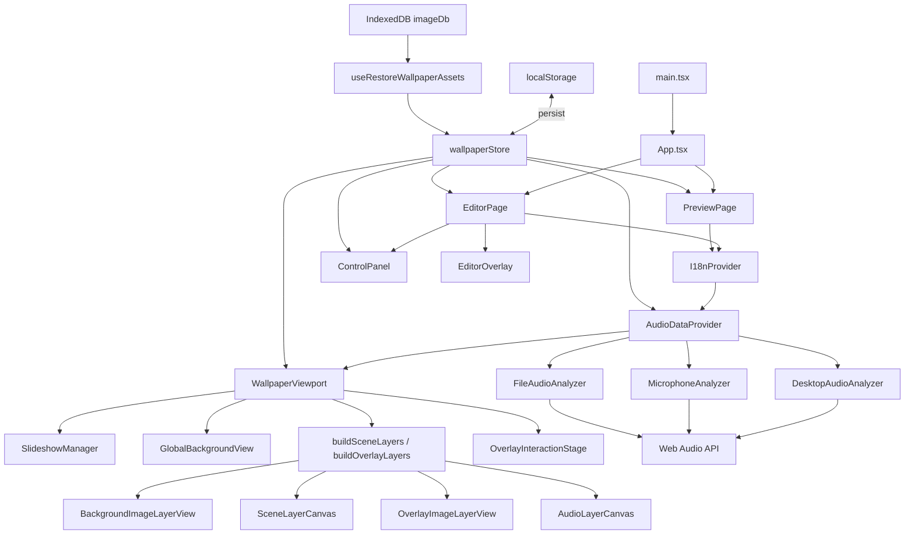

# Arquitectura General de LiveWallpaperAnimeGlitch

## Estado de esta guia (2026-04)

Este documento sigue siendo valido como mapa del sistema. Como actualizacion reciente:

- El proyecto reforzo el enfoque de ownership por dominio (layout, audio, overlays, background, persistencia).
- `AudioDataContext` fue dividido en hooks especializados y ahora opera como orquestador.
- La logica de background canvas se separo en modulos de transiciones, post-efectos y tipos compartidos.
- El drag de overlays se extrae en `useOverlayDragController`.
- Hay un pendiente activo de viewport multi-monitor en Brave (ver `docs/status/HANDOFF_VIEWPORT_HUD_MULTI_MONITOR.md`).

Este documento explica el proyecto desde una vista de sistema completa.
La idea es que puedas:

- entender como esta armado hoy,
- ubicar rapido donde vive cada feature,
- y explicarselo a otra persona sin tener que abrir 40 archivos primero.

No es una guia de "como usar la app".
Es una guia de "como pensar el codigo".

---

## 1. Que tipo de proyecto es

LiveWallpaperAnimeGlitch es un **editor de wallpapers audio-reactivos en navegador**.

No es solo un visualizer.
Hoy ya tiene piezas de editor real:

- `editor` y `preview` separados,
- estado global persistente,
- wallpapers con slideshow,
- overlays cargables,
- BG global de respaldo,
- audio desde desktop, microfono o MP3,
- spectrum y logo reactivo,
- particulas y lluvia,
- presets globales,
- slots locales guardables para `logo` y `spectrum`,
- export/import de settings.

La arquitectura es **hibrida**:

- React para UI y coordinacion,
- Zustand para estado global,
- Canvas 2D para varias capas visuales,
- React Three Fiber / Three.js para capas GPU,
- Web Audio API para analisis de sonido,
- IndexedDB para binarios.

---

## 2. Diagrama general

---

## 3. Principio estructural mas importante

La mejor forma de entender el repo es esta:

### Capa 1: El store describe la escena

`wallpaperStore.ts` contiene el "documento" completo de la escena:

- configuracion visual,
- configuracion de audio,
- overlays,
- slideshow,
- persistencia,
- orden de capas,
- presets.

### Capa 2: `lib/layers.ts` traduce estado a layers

El store es muy grande y orientado a UI.
`lib/layers.ts` toma ese estado y lo convierte en algo mas renderizable:

- `scene layers`
- `overlay layers`
- `controller layers`

### Capa 3: `WallpaperViewport` compone

`WallpaperViewport.tsx` agarra esas layers y decide:

- que renderer usar para cada una,
- en que orden se dibujan,
- y que elementos solo existen en editor.

### Capa 4: cada familia de visuales usa su propio pipeline

No todo se renderiza igual:

- fondo y overlays de imagen -> canvas 2D / DOM
- spectrum y logo -> canvas 2D imperativo
- lluvia y particulas -> R3F + shaders

Ese es el gran secreto del proyecto.
No hay un solo renderer universal.

---

## 4. Modulos principales y conexion entre ellos

## 4.1 Entrada y rutas

### `src/main.tsx`

- Monta React.

### `src/App.tsx`

- Usa `HashRouter`.
- Define:
    - `#/`
    - `#/editor`
    - `#/preview`

### `src/pages/EditorPage.tsx`

- Arranque del modo editor.
- Monta:
    - `I18nProvider`
    - `AudioDataProvider`
    - `WallpaperViewport editorMode`
    - `ControlPanel`

### `src/pages/PreviewPage.tsx`

- Arranque del modo preview.
- Usa el mismo viewport, pero sin el panel completo.
- Escucha `storage` para sincronizar cambios desde el editor.

**Conexion:** las rutas no crean dos apps distintas. Crean dos envolturas distintas sobre el mismo motor de escena.

---

## 4.2 Estado global

### `src/store/wallpaperStore.ts`

- Store Zustand + persist.
- Tiene setters, migraciones, acciones de presets y manejo de assets.

### `src/types/wallpaper.ts`

- Define el shape completo del estado.

### `src/lib/constants.ts`

- `DEFAULT_STATE`

**Conexion:** casi toda la app lee o escribe aqui.
Es la columna vertebral del proyecto.

---

## 4.3 Modelo de layers

### `src/types/layers.ts`

- Define tipos abstractos de layers:
    - `BackgroundImageLayer`
    - `SlideshowLayer`
    - `OverlayImageLayer`
    - `LogoLayer`
    - `SpectrumLayer`
    - `ParticleBackgroundLayer`
    - `ParticleForegroundLayer`
    - `RainLayerModel`

### `src/lib/layers.ts`

- Construye layers reales desde `WallpaperState`.

**Por que importa:**
Sin esto, el viewport tendria logica mezclada de UI y render.
Con esto, el render trabaja contra un modelo mas limpio.

---

## 4.4 Compositor de escena

### `src/components/wallpaper/WallpaperViewport.tsx`

- Es el orchestrator visual.
- Hace:
    - slideshow timing,
    - fondo global,
    - construccion de stack,
    - dispatch a renderers concretos,
    - overlay drag stage en editor.

### Orden actual de composicion

1. `GlobalBackgroundView`
2. layers del stack global ordenadas por `zIndex`
3. `OverlayInteractionStage` solo en editor

---

## 4.5 Background y slideshow

### `src/components/SlideshowManager.tsx`

- No renderiza nada.
- Solo cambia `activeImageId` segun el timer.

### `src/components/wallpaper/layers/BackgroundImageLayerView.tsx`

- Wrapper del wallpaper principal.
- Hoy usa la ruta estable:
    - `ImageLayerCanvas`

### `src/components/wallpaper/layers/ImageLayerCanvas.tsx`

- Renderiza:
    - wallpaper principal,
    - overlays con efectos avanzados.

Ademas concentra:

- fit modes,
- scale / position,
- slideshow transitions,
- RGB shift,
- glitch,
- film noise,
- scanlines,
- color filters,
- blur,
- crop y edge effects.

### `src/components/wallpaper/GlobalBackgroundView.tsx`

- Fondo fijo de respaldo detras del slideshow.
- Evita que aparezca negro cuando cambian imagenes o escalas.

### `src/lib/backgroundImages.ts`

- Helpers de coleccion de wallpapers.

---

## 4.6 Audio

### `src/context/AudioDataContext.tsx`

- Abstraccion principal de audio.
- Ofrece una API unificada al resto de la app.

### `src/lib/audio/types.ts`

- Contrato `IAudioSourceAdapter`.

### Adaptadores concretos

#### `DesktopAudioAnalyzer.ts`

- `getDisplayMedia`
- captura audio de pestana / desktop

#### `MicrophoneAnalyzer.ts`

- `getUserMedia`
- captura microfono

#### `FileAudioAnalyzer.ts`

- usa `HTMLAudioElement`
- permite MP3, pause, resume, seek, loop, volume

**Conexion:** el resto del sistema no sabe si el audio viene de desktop, mic o archivo. Solo consume bins, bands y amplitude.

---

## 4.7 Spectrum

### `src/components/audio/CircularSpectrum.ts`

- Renderer del spectrum.
- Soporta layouts circulares y lineales.
- Tiene logica propia de smoothing y ahora tambien transicion de modo por snapshot/fade.

### `src/components/audio/layers/AudioLayerCanvas.tsx`

- Canvas dedicado a audio layers.

### `src/components/audio/layers/overlayLayerRegistry.ts`

- Conecta el layer `spectrum` con el renderer real.
- Tambien decide `follow logo`.

### `src/components/controls/tabs/SpectrumTab.tsx`

- UI de configuracion.
- Incluye slots guardables locales.

---

## 4.8 Logo reactivo

### `src/components/audio/ReactiveLogo.ts`

- Render canvas imperativo del logo.
- Tiene estado temporal fuera de React:
    - smoothed amplitude,
    - adaptive peak,
    - adaptive floor,
    - rendered scale.

### `src/components/audio/layers/overlayLayerRegistry.ts`

- Calcula el drive real del logo desde bins y bandas.

### `src/components/controls/tabs/LogoTab.tsx`

- UI del logo.
- Incluye quick profiles y slots guardables locales.

---

## 4.9 Particulas

### `src/components/wallpaper/ParticleField.tsx`

- Renderer shader/GPU de particulas.
- Usa uniforms y atributos custom.

### `src/components/wallpaper/ParticlesBackground.tsx`

### `src/components/wallpaper/ParticlesForeground.tsx`

- Colocan las particulas atras o adelante.

### `src/components/controls/tabs/ParticlesTab.tsx`

- UI de particulas.

---

## 4.10 Lluvia

### `src/components/wallpaper/RainLayer.tsx`

- Capa shader de lluvia.
- Usa plano full-screen + uniforms.

### `src/components/controls/tabs/RainTab.tsx`

- UI de lluvia.

---

## 4.11 Overlays

### `src/components/controls/tabs/OverlaysTab.tsx`

- Gestiona overlays del usuario.

### `src/components/wallpaper/layers/OverlayImageLayerView.tsx`

- Render final del overlay.
- Usa imagen DOM base y, si hace falta, canvas de efectos.

### `src/components/wallpaper/OverlayInteractionStage.tsx`

- Solo hitbox de arrastre invisible.

---

## 4.12 Persistencia

### Config

- `wallpaperStore.ts` persistiendo en `localStorage`
- key: `lwag-state`

### Assets binarios

- `src/lib/db/imageDb.ts`
- IndexedDB para:
    - wallpapers
    - logo
    - overlays
    - BG global

### Restauracion

- `src/hooks/useRestoreWallpaperAssets.ts`

### Export/import

- `src/lib/projectSettings.ts`
- exporta JSON de settings
- no empaqueta binarios todavia

---

## 4.13 UI del editor

### `src/components/controls/ControlPanel.tsx`

- Panel flotante compacto.

### `src/components/controls/EditorOverlay.tsx`

- Editor expandido full overlay.

### `src/components/controls/tabs/*`

- Cada pestaña controla un subconjunto del store.

---

## 5. Flujo de arranque completo

1. El navegador carga Vite.
2. `main.tsx` monta `App`.
3. El router decide `EditorPage` o `PreviewPage`.
4. Se monta `I18nProvider`.
5. Se monta `AudioDataProvider`.
6. Zustand rehidrata config desde `localStorage`.
7. `useRestoreWallpaperAssets()` recupera assets desde IndexedDB.
8. `WallpaperViewport` compone la escena.
9. `SlideshowManager` corre si hay slideshow activo.
10. Si el usuario activa audio:
    - se crea el adapter correcto,
    - `AnalyserNode` empieza a producir bins.
11. Cada pipeline visual lee audio y dibuja frame a frame.
12. El store sigue persistiendo cambios automaticamente.

---

## 6. Dependencias clave y por que estan

### `react`

- UI base

### `react-router-dom`

- rutas editor / preview

### `zustand`

- store global

### `three`

- objetos, materiales, shaders, geometria

### `@react-three/fiber`

- integrar Three con React

### `vite`

- build y dev server

### `vite-plugin-glsl`

- importar shaders `.glsl`

### `tailwindcss`

- estilos del editor

### Dependencias instaladas pero no evidentes hoy

- `framer-motion`
- `@react-three/drei`

Parecen no usarse activamente en `src/`.

---

## 7. Cosas no obvias que conviene entender

## 7.1 No hay un solo renderer

El sistema actual reparte el trabajo entre:

- DOM/CSS
- Canvas 2D
- R3F/WebGL

Eso le da flexibilidad, pero complica el debugging.

## 7.2 El store duplica algunos conceptos del BG

Hay estado "derivado" y estado "coleccion":

- `imageUrl / imageScale / imagePositionX / imageFitMode`
- `backgroundImages[] + activeImageId`

Esto existe por ergonomia y compatibilidad, pero mete complejidad.

## 7.3 `ImageLayerCanvas.tsx` es un modulo central

Si el fondo, filtros o transitions fallan, muchas veces la causa esta ahi.

## 7.4 Logo y spectrum no son componentes declarativos clasicos

Tienen estado interno frame a frame.
Eso es ideal para suavizado y performance, pero menos intuitivo que puro React.

---

## 8. Orden recomendado para estudiar el repo

1. `src/App.tsx`
2. `src/pages/EditorPage.tsx`
3. `src/components/wallpaper/WallpaperViewport.tsx`
4. `src/store/wallpaperStore.ts`
5. `src/types/wallpaper.ts`
6. `src/lib/layers.ts`
7. `src/components/wallpaper/layers/ImageLayerCanvas.tsx`
8. `src/context/AudioDataContext.tsx`
9. `src/components/audio/ReactiveLogo.ts`
10. `src/components/audio/CircularSpectrum.ts`
11. `src/components/controls/ControlPanel.tsx`
12. `src/components/controls/tabs/BgTab.tsx`
13. `src/components/controls/tabs/AudioTab.tsx`
14. `src/components/controls/tabs/OverlaysTab.tsx`
15. `src/hooks/useRestoreWallpaperAssets.ts`
16. `src/lib/projectSettings.ts`

---

## 9. Riesgos y deuda tecnica visibles hoy

### Store muy grande

`wallpaperStore.ts` hace demasiado.

### Multiples pipelines

El proyecto es potente, pero el debugging visual es mas caro.

### Modulos "legacy" o secundarios aun presentes

Hay archivos que ya no son la ruta principal del render y pueden confundir:

- `WallpaperCanvas.tsx`
- `WallpaperScene.tsx`
- `AudioOverlay.tsx`
- `BackgroundPlane.tsx`
- `FxLayerCanvas.tsx`

### Export/import aun es de config, no de proyecto completo portable

Todavia no hay paquete con assets + audio.

### Falta de tests

Buena parte de la validacion sigue siendo visual/manual.

---

## 10. Forma corta de explicarselo a otra persona

> "Es un editor de wallpapers audio-reactivos en navegador.  
> React maneja la UI, Zustand guarda toda la escena, localStorage guarda config, IndexedDB guarda imagenes.  
> El viewport convierte el estado en layers y las renderiza por distintos pipelines: canvas 2D para fondos y overlays, canvas 2D para spectrum y logo, y WebGL/Three para lluvia y particulas.  
> El audio puede venir del escritorio, microfono o MP3, pero todo entra por la misma interfaz de analisis.  
> El proyecto ya esta a medio camino entre demo visualizer y editor real."
