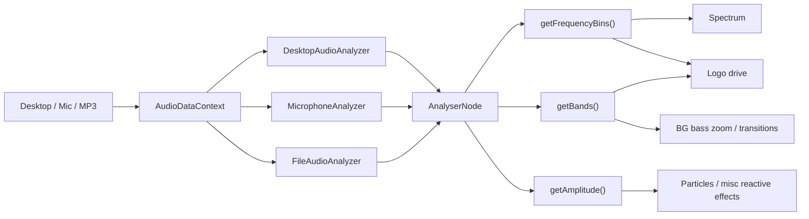

# Audio, Render y Shaders en LiveWallpaperAnimeGlitch

Este documento esta enfocado solo en el pipeline tecnico de:

- entrada de audio,
- analisis,
- consumo por las visuales,
- render 2D / 3D,
- y donde entran los shaders.

Si `ARQUITECTURA_GENERAL.md` explica el sistema completo, este explica el **motor visual y sonoro**.

---

## 1. Idea central

El proyecto funciona porque une 3 subsistemas:

1. **captura de audio**
2. **analisis de audio**
3. **render visual reactivo**

La arquitectura busca que cualquier visual pueda preguntarle al audio:

- cual es la amplitud actual,
- cuales son las bandas principales,
- cuales son los bins FFT,

sin importar de donde vino el audio originalmente.

---

## 2. Mapa del pipeline de audio



---

## 3. Audio: de donde sale la informacion

## 3.1 Fachada principal

### `src/context/AudioDataContext.tsx`

Este modulo hace dos trabajos:

1. decide que adapter usar,
2. expone una API simple al resto del proyecto.

API importante:

- `getAmplitude()`
- `getPeak()`
- `getBands()`
- `getFrequencyBins()`
- `startCapture()`
- `startFileCapture(file)`
- `stopCapture()`
- `pauseCapture()`
- `resumeCapture()`
- `seek()`
- `getCurrentTime()`
- `getDuration()`
- `setFileVolume()`
- `setFileLoop()`

La clave es que todo lo visual consume esta capa.
No habla directamente con `getDisplayMedia` ni con `HTMLAudioElement`.

---

## 3.2 Contrato de adapters

### `src/lib/audio/types.ts`

`IAudioSourceAdapter` define el contrato comun:

- `start`
- `stop`
- `setAnalysisConfig`
- `getFrequencyBins`
- `getAmplitude`
- `getPeak`
- `getBands`

Y opcionalmente:

- `pause`
- `resume`
- `seek`
- `getCurrentTime`
- `getDuration`
- `setVolume`
- `setLoop`
- `getFileName`

Esto permite que un renderer no se preocupe por la fuente.

---

## 3.3 Desktop audio

### `src/lib/audio/DesktopAudioAnalyzer.ts`

Usa:

- `navigator.mediaDevices.getDisplayMedia`
- `AudioContext`
- `AnalyserNode`
- `MediaStreamAudioSourceNode`

Flujo:

1. pide una captura de display con audio,
2. descarta video,
3. se queda con la pista de audio,
4. crea un `AudioContext`,
5. crea `AnalyserNode`,
6. conecta la fuente al analizador.

Produce:

- bins FFT
- amplitud promedio
- peak
- bandas bass/mid/treble

---

## 3.4 Microfono

### `src/lib/audio/MicrophoneAnalyzer.ts`

Usa:

- `getUserMedia({ audio: true })`
- `AudioContext`
- `AnalyserNode`

La logica es casi la misma que desktop, pero la fuente es el stream del microfono.

---

## 3.5 Archivo MP3

### `src/lib/audio/FileAudioAnalyzer.ts`

Este adapter es interesante porque hace doble trabajo:

- analisis,
- y reproduccion.

Usa:

- `HTMLAudioElement`
- `MediaElementAudioSourceNode`
- `GainNode`
- `AnalyserNode`

Flujo:

1. crea un `blob URL` del archivo,
2. crea `HTMLAudioElement`,
3. crea `AudioContext`,
4. crea la cadena:

```text
audio element -> MediaElementSource -> AnalyserNode -> GainNode -> speakers
```

Esto permite:

- reproducir el MP3,
- ver su analisis en tiempo real,
- controlar seek, loop y volumen.

---

## 4. Que representa cada medida de audio

## 4.1 `getFrequencyBins()`

Devuelve el espectro completo FFT como `Uint8Array`.
Es la informacion mas rica.

La usa sobre todo:

- spectrum
- logo drive avanzado

## 4.2 `getBands()`

Reduce el espectro a:

- `bass`
- `mid`
- `treble`

Es util para:

- reactividad simple,
- decisiones rapidas de FX,
- transiciones o zoom bass-reactive.

## 4.3 `getAmplitude()`

Saca una amplitud promedio general.

Es util para:

- efectos globales ligeros,
- particulas,
- visuales donde no hace falta precision de banda.

---

## 5. Pipeline de render: no hay uno solo

El proyecto tiene tres motores visuales coexistiendo:

## 5.1 DOM / CSS

Se usa en overlays base.

Ventajas:

- simple,
- barato,
- muy estable para imagenes.

Ejemplo:
- `OverlayImageLayerView.tsx`

## 5.2 Canvas 2D

Se usa para:

- BG principal,
- overlays con efectos avanzados,
- logo,
- spectrum,
- BG global.

Ventajas:

- muy flexible para composicion 2D,
- facil mezclar filtros procedurales,
- menos complejidad que un shader para ciertos FX.

## 5.3 WebGL / Three / R3F

Se usa para:

- particulas,
- lluvia.

Ventajas:

- mejor para muchas primitivas,
- shaders custom,
- trabajo en GPU.

---

## 6. Como se compone el render final

### `src/components/wallpaper/WallpaperViewport.tsx`

Es el compositor principal.

Orden conceptual:

1. `GlobalBackgroundView`
2. stack de scene layers y overlay layers
3. hitbox de overlays en editor

Segun el tipo de layer, el viewport usa uno de estos renderers:

- `BackgroundImageLayerView`
- `SceneLayerCanvas`
- `OverlayImageLayerView`
- `AudioLayerCanvas`

---

## 7. Fondo y capas de imagen

## 7.1 BG global

### `src/components/wallpaper/GlobalBackgroundView.tsx`

Es un canvas 2D fijo detras de todo.
Sirve para evitar "flash negro" cuando:

- cambia la imagen principal,
- cambia la escala,
- corre una transicion agresiva,
- o hay gaps visuales.

Tiene su propio set de filtros.

---

## 7.2 Wallpaper principal

### `src/components/wallpaper/layers/BackgroundImageLayerView.tsx`

Hoy delega al renderer estable:

- `ImageLayerCanvas`

Eso es importante historicamente:
el BG tuvo varias rutas de render y muchos bugs venian de que se dibujaba dos veces o por pipelines distintos.

---

## 7.3 `ImageLayerCanvas.tsx`

Esta es una de las piezas mas densas del proyecto.

Hace al menos estas cosas:

- carga imagenes cacheadas,
- calcula rectangulos segun fit mode,
- aplica posicion y escala,
- maneja slideshow transitions,
- decide si un filtro aplica o no segun `filterTarget`,
- dibuja RGB shift,
- dibuja glitch,
- dibuja film noise,
- dibuja scanlines,
- aplica filtros de color,
- maneja crop/edges en overlays.

### Por que esta pieza es tan importante

Porque el "look" de la app depende muchisimo de ella.
Cuando algo se rompe en:

- filtros,
- transiciones,
- BG,
- overlay image FX,

muchas veces la causa real esta aqui.

---

## 8. Logo reactivo

## 8.1 Renderer

### `src/components/audio/ReactiveLogo.ts`

El logo no vive como un `img` normal.
Se dibuja manualmente en canvas.

Estado interno:

- `smoothedAmplitude`
- `lastAmplitude`
- `adaptivePeak`
- `adaptiveFloor`
- `renderedScale`

Esto permite:

- attack/release reales,
- memoria de pico,
- normalizacion adaptativa,
- reactividad suave pero con punch.

### Logica de reactividad

El flujo interno es:

1. entra un `amplitude` o drive del logo,
2. se suaviza con attack/release,
3. se actualiza un pico adaptativo,
4. se actualiza un piso adaptativo,
5. se normaliza la energia,
6. se calcula el `targetScale`,
7. se interpola hacia la escala renderizada.

No es React quien anima el logo.
Es un mini motor imperativo.

---

## 8.2 De donde sale el drive del logo

### `src/components/audio/layers/overlayLayerRegistry.ts`

Para el logo, este modulo:

- mira bins completos,
- saca picos top por banda,
- mezcla bass/mid/treble,
- respeta `logoBandMode`,
- multiplica por sensibilidad,
- y llama `drawLogo(...)`.

Eso separa:

- **analisis del impulso**
- **render del logo**

---

## 9. Spectrum

## 9.1 Renderer

### `src/components/audio/CircularSpectrum.ts`

Aunque se llama `CircularSpectrum`, en realidad soporta:

- `circular`
- `bottom`
- `top`
- `top-inverted`
- `left`
- `right`
- `center`

Y shapes:

- `bars`
- `lines`
- `wave`
- `dots`

### Estado interno

Mantiene:

- `smoothedHeights`
- `peakHeights`
- `rotation`
- `idleTime`
- snapshot del modo anterior para transición

### Transicion de modo

Cuando cambian layout/shape/otros parametros estructurales:

1. guarda un snapshot del frame anterior,
2. reinicia un pequeño temporizador,
3. dibuja el modo nuevo,
4. mezcla encima el snapshot anterior con fade.

Eso evita saltos visuales bruscos cuando cambias modo o cargas perfiles.

---

## 9.2 Follow logo

`overlayLayerRegistry.ts` ajusta el spectrum si:

- el layout es circular,
- `followLogo` esta activo,
- y el logo esta habilitado.

Entonces recalcula:

- `spectrumInnerRadius`
- `spectrumPositionX`
- `spectrumPositionY`

usando el estado renderizado real del logo.

---

## 10. Particulas

## 10.1 Renderer base

### `src/components/wallpaper/ParticleField.tsx`

Aqui entra la GPU fuerte.

Usa:

- `bufferGeometry`
- `shaderMaterial`
- `useFrame`
- atributos custom
- uniforms custom

### Atributos por particula

- posicion
- velocidad
- size
- color
- offset
- life

### Uniforms importantes

- `uTime`
- `uOpacity`
- `uGlowStrength`
- `uAmplitude`
- `uAudioSizeBoost`
- `uAudioOpacityBoost`
- `uAudioReactive`
- `uShape`
- `uScanlineIntensity`
- `uRotationIntensity`
- `uRotationDirection`

### Resultado

La CPU prepara buffers y la GPU termina de dar forma visual.

---

## 10.2 Shaders de particulas

### `src/shaders/particleVertex.glsl`
- posicion y tamaño base

### `src/shaders/particleFragment.glsl`
- forma visual de la particula
- glow
- scanlines
- rotacion
- variaciones visuales

---

## 11. Lluvia

### `src/components/wallpaper/RainLayer.tsx`

La lluvia es un plano full-screen con shader.

Uniforms:

- tiempo
- intensidad
- drop count
- angulo
- speed
- length
- width
- blur
- variation
- color
- color mode
- particle type

### Shaders

- `rainVertex.glsl`
- `rainOverlayFragment.glsl`

La lluvia no se modela gota por gota como objetos React.
Se genera proceduralmente en shader.

---

## 12. SceneLayerCanvas y por que existe

### `src/components/wallpaper/layers/SceneLayerCanvas.tsx`

Es un canvas R3F por layer de escena.

Se usa para encapsular layers GPU como:

- particulas,
- lluvia.

Ventajas:

- cada layer queda aislada,
- se puede controlar `zIndex`,
- se puede bajar `dpr` segun el tipo de layer,
- es mas facil de combinar con el stack global HTML/canvas.

---

## 13. Overlays de imagen y por que mezclan DOM + canvas

### `src/components/wallpaper/layers/OverlayImageLayerView.tsx`

Estrategia actual:

- render base del overlay como `img` DOM
- si hay efectos avanzados, sumar `ImageLayerCanvas`

### Por que esto tiene sentido

Porque una imagen DOM:

- es muy estable,
- es barata,
- evita varios bugs de carga / textura,
- y se ve bien sin necesidad de entrar al camino caro de efectos.

Solo cuando hacen falta:

- glitch
- rgb shift
- film
- scanlines
- color filters

se añade el render canvas avanzado.

---

## 14. Persistencia de assets en el pipeline visual

### `src/lib/db/imageDb.ts`

Guarda binarios de imagen en IndexedDB.

### `src/hooks/useRestoreWallpaperAssets.ts`

Al restaurar:

1. toma ids guardados en el store,
2. carga blobs desde IndexedDB,
3. crea `blob URLs`,
4. actualiza el store para que las capas visuales tengan `url` real.

Esto es importante porque el render necesita `url`, pero el estado persistido solo deberia guardar ids.

---

## 15. Export / import de settings

### `src/lib/projectSettings.ts`

Exporta:

- config serializada
- sin assets binarios incluidos

Importa:

- vuelve a poblar el estado,
- luego intenta reconectar assets locales via `restoreWallpaperAssets()`.

Esto es solo la primera capa del sistema de proyectos.
Todavia no es un paquete portable completo.

---

## 16. Donde estan los shaders y para que sirve cada uno

### Background / image FX
- `backgroundFragment.glsl`
- `backgroundVertex.glsl`
- `rgbSplitFragment.glsl`
- `waveDistortionFragment.glsl`
- `scanlineFragment.glsl`

Nota: no todos son necesariamente la ruta principal actual del BG, pero forman parte del arsenal visual historico del proyecto.

### Particulas
- `particleVertex.glsl`
- `particleFragment.glsl`

### Lluvia
- `rainVertex.glsl`
- `rainOverlayFragment.glsl`

---

## 17. Partes mas delicadas del pipeline tecnico

## 17.1 `ImageLayerCanvas.tsx`
Pieza fragil por mezcla de:

- transitions,
- filters,
- glitch,
- overlay effects,
- background logic,
- target logic.

## 17.2 `AudioDataContext.tsx`
Muy importante porque cualquier bug de fuente de audio afecta todo el sistema reactivo.

## 17.3 `CircularSpectrum.ts`
Tiene mucha logica visual, smoothing, rotacion, layouts y ahora snapshots.

## 17.4 `ReactiveLogo.ts`
Suaviza y normaliza internamente. Si cambias una formula sin cuidado, el logo se vuelve plano o exagerado.

## 17.5 Convivencia de pipelines
Cuando un efecto "existe" pero no se ve, muchas veces el problema no es el slider, sino que la capa visible no es la que esta recibiendo el efecto.

---

## 18. Orden recomendado para estudiar el pipeline visual

1. `src/context/AudioDataContext.tsx`
2. `src/lib/audio/types.ts`
3. `src/lib/audio/DesktopAudioAnalyzer.ts`
4. `src/lib/audio/FileAudioAnalyzer.ts`
5. `src/components/wallpaper/WallpaperViewport.tsx`
6. `src/lib/layers.ts`
7. `src/components/wallpaper/layers/ImageLayerCanvas.tsx`
8. `src/components/audio/layers/AudioLayerCanvas.tsx`
9. `src/components/audio/layers/overlayLayerRegistry.ts`
10. `src/components/audio/ReactiveLogo.ts`
11. `src/components/audio/CircularSpectrum.ts`
12. `src/components/wallpaper/ParticleField.tsx`
13. `src/components/wallpaper/RainLayer.tsx`

---

## 19. Resumen simple

> "El motor del proyecto funciona asi:  
> primero entra una fuente de audio y se normaliza a una API comun.  
> Luego cada visual consume esa informacion segun su necesidad: bins para spectrum, mezcla de bandas para el logo, amplitud para otros FX.  
> El render final no sale de una sola tecnologia; mezcla canvas 2D, DOM y WebGL.  
> El fondo y overlays de imagen viven sobre todo en canvas 2D, el logo y spectrum en otro canvas 2D, y las particulas y lluvia en GPU con Three.js.  
> Todo eso se ordena en un stack global de layers basado en Zustand." 

---

## 20. Deuda tecnica especifica del pipeline visual

### Mezcla de rutas de render historicas
Hay modulos de render antiguos o secundarios aun presentes.

### `ImageLayerCanvas` concentra demasiado
Es el equivalente a una "super pieza" del BG y overlays.

### Multiples lugares para el mismo efecto conceptual
Ejemplo:

- filters,
- glitch,
- bg transitions,
- overlay image effects

comparten terreno y pueden cruzarse.

### Sin suite de tests visuales
Muchos bugs solo se detectan en navegador probando sliders.

