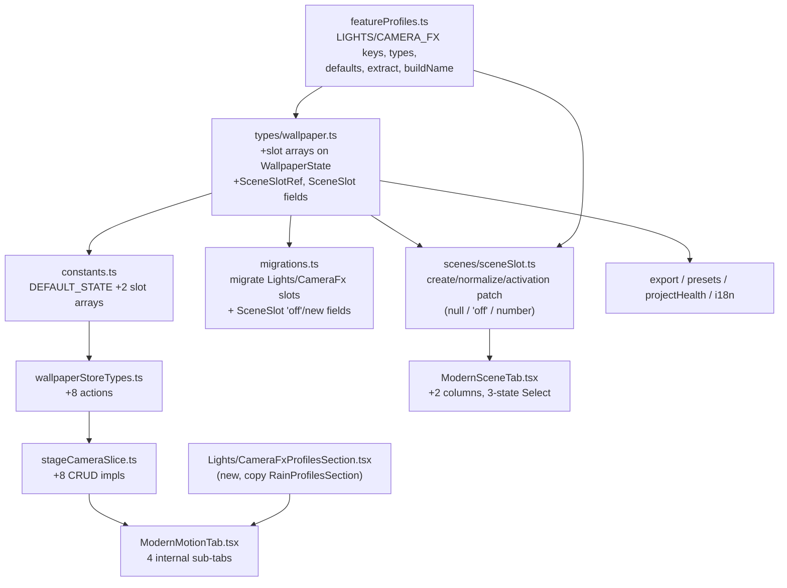

# Plan: Lights/Camera slots + 3-state scene bindings + Motion sub-tabs

## Context

The **Motion** tab is one flat list mixing four unrelated subsystems: particles, rain,
lights (Stage Lights + Flash Light) and camera (Camera Motion + Screen Shake). Today only
particles and rain expose saveable **slots** that **Scenes** can reference per image; lights
and camera cannot be composed per image at all.

Scene binding also has two UX defects:

1. Each effect's dropdown only lists saved slots. Once you pick a slot you **can't go back to
   "none"**, and there's no way to say "this image must have NO rain" — a `null` ref means
   "don't touch / keep current state", so the previous image's rain leaks through.
2. Slots don't show their **number** in the picker.

### Desired outcome

- Motion reorganized into **internal sub-tabs**: Particles | Rain | Lights | Camera, each with
  its own saved-slots grid (same pattern rain/particles already use).
- Two new slot subsystems: **Lights** (stage+flash together) and **Camera** (motion+shake together).
- Scenes can reference Lights and Camera per image.
- Every scene binding is **3-state**: `No change` (null), `Disabled` (forces the effect OFF on
  that image), and the saved slots (number shown).

All four decisions (4 subsystems, internal sub-tabs, 3-state bindings incl. "Disabled") are
confirmed; this plan implements them.

## Template to replicate

The **rain** slot subsystem is the exact template. Each new subsystem (`lights`, `cameraFx`)
mirrors every `rain` touch-point. Key reference files:

- Keys/types/defaults/extract/build: `src/lib/featureProfiles.ts` (`RAIN_PROFILE_KEYS`,
  `RainProfileSettings`, `createDefaultRainProfileSlots`, `extractRainProfileSettings`,
  `buildRainProfileName`, counts `RAIN_PROFILE_SLOT_COUNT`/`MAX_RAIN_SLOT_COUNT`).
- Slot CRUD: `addRainProfileSlot`/`removeRainProfileSlot`/`saveRainProfileSlot`/`loadRainProfileSlot`
  in `src/store/slices/particlesRainSlice.ts:213-259`.
- Migration: `migrateRainProfileSlots` `src/store/wallpaperStoreMigrations.ts:549`.
- Profiles UI section: `src/components/controls/tabs/modern/motion/RainProfilesSection.tsx`.

Implement in the dependency order above (data layer → store → scenes → UI → aux).

---

## 1. `src/lib/featureProfiles.ts`

Mirror the rain block exactly. Source keys from `src/types/wallpaper.ts`:

- `LIGHTS_PROFILE_KEYS` = all `stageLights*` (1401-1430) **+** all `flashLight*` (1433-1446).
  Must start with `stageLightsEnabled` and include `flashLightEnabled` (needed to force-off).
  Include the `@deprecated` `stageLightsBeamCount`/`stageLightsPeakFlash` fields (they're real
  `WallpaperState` keys; excluding them is optional but keep it simple — include the full block).
- `CAMERA_FX_PROFILE_KEYS` = `cameraMotion*` (1503-1513) + `cameraShake*` (1514-1525). **Exclude**
  the deprecated scalar `cameraMotionTarget`; keep `cameraMotionTargets`. (Skip `cameraFxEnabled`
  — it's the deprecated compat flag.) First key = `cameraMotionEnabled`.
- Derived types `LightsProfileSettings`, `CameraFxProfileSettings` via `Pick` (like `RainProfileSettings`).
- Counts: `LIGHTS_PROFILE_SLOT_COUNT = 3`, `MAX_LIGHTS_SLOT_COUNT = 20`; same for `CAMERA_FX_*`.
- `createDefaultLightsProfileSlots()` / `createDefaultCameraFxProfileSlots()` via `createEmptySlots`
  (prefixes `'Lights'`, `'Camera'`).
- `extractLightsProfileSettings()` / `extractCameraFxProfileSettings()` via `pickState`.
- `buildLightsProfileName()` / `buildCameraFxProfileName()` — short descriptive text, e.g.
  ``const sl = s.stageLightsEnabled ? 'S' : 's'; const fl = s.flashLightEnabled ? 'F' : 'f'; return `${sl}${fl} · ${s.stageLightsMovementMode}`;`` and
  ``const cm = s.cameraMotionEnabled ? 'M' : 'm'; const cs = s.cameraShakeEnabled ? 'S' : 's'; return `${cm}${cs} · ${s.cameraMotionMode}`;``

## 2. `src/types/wallpaper.ts`

- On `WallpaperState` (near `rainProfileSlots` ~1341): add
  `lightsProfileSlots: ProfileSlot<import('@/lib/featureProfiles').LightsProfileSettings>[]` and
  `cameraFxProfileSlots: ProfileSlot<import('@/lib/featureProfiles').CameraFxProfileSettings>[]`.
- Add `export type SceneSlotRef = number | 'off' | null;`
- `SceneSlot` (350-359): change **all** six existing `*SlotIndex` from `number | null` to
  `SceneSlotRef`, and add `lightsSlotIndex: SceneSlotRef` and `cameraFxSlotIndex: SceneSlotRef`.

## 3. `src/lib/constants.ts`

Import `createDefaultLightsProfileSlots`/`createDefaultCameraFxProfileSlots` and add to
`DEFAULT_STATE` next to `rainProfileSlots` (~557):
`lightsProfileSlots: createDefaultLightsProfileSlots(), cameraFxProfileSlots: createDefaultCameraFxProfileSlots()`.

## 4. `src/store/wallpaperStoreTypes.ts`

Next to the rain CRUD declarations (742-745) add 8 action signatures:
`add/remove(index)/save(index)/loadLightsProfileSlot` and `…CameraFxProfileSlot` (same shapes).

## 5. `src/store/slices/stageCameraSlice.ts`

Add the 8 CRUD impls, copying `addRainProfileSlot`…`loadRainProfileSlot` verbatim
(`particlesRainSlice.ts:213-259`): min delete index 3, cap `MAX_LIGHTS_SLOT_COUNT`/`MAX_CAMERA_FX_SLOT_COUNT`,
`save` uses `extract*` + `build*Name`, `load` merges over `extract*(DEFAULT_STATE)`.
Add imports: the new `extract*`/`build*Name`/`MAX_*` from `@/lib/featureProfiles`, and
`DEFAULT_STATE` from `@/lib/constants` (file currently imports neither). Append before the closing
`} satisfies Partial<WallpaperStore>;` if present, else inside the returned object.

## 6. `src/store/wallpaperStoreMigrations.ts`

- Add `migrateLightsProfileSlots` / `migrateCameraFxProfileSlots` (copy `migrateRainProfileSlots:549`,
  with the new `createDefault*` + `MAX_*` + prefixes `'Lights'`/`'Camera'`). Plug into state assembly
  next to `rainProfileSlots:` (2853-2854).
- In `migrateSceneSlots` (586-607): each `*SlotIndex` mapping must now also preserve the `'off'`
  literal — change `typeof s.X === 'number' ? s.X : null` to
  `typeof s.X === 'number' ? s.X : s.X === 'off' ? 'off' : null`. Add the two new fields
  `lightsSlotIndex`/`cameraFxSlotIndex` with the same 3-way mapping.

## 7. `src/features/scenes/sceneSlot.ts`

- `createEmptySceneSlot` (33-44): add `lightsSlotIndex: null, cameraFxSlotIndex: null`.
- `normalizeSlotRef` (51-58): retype to accept/return `SceneSlotRef`; if `ref === 'off'` return
  `'off'` unchanged; rest unchanged.
- `normalizeSceneSlotAgainstState` (60-91): add normalization for `lightsSlotIndex`
  (`state.lightsProfileSlots.length`) and `cameraFxSlotIndex` (`state.cameraFxProfileSlots.length`).
- `buildSceneSlotActivationPatch` (98-164): for **each** subsystem switch from `!== null` to a
  3-case handler:
    - `null` → add nothing (keep current).
    - `'off'` → assign the force-off patch: rain→`{rainEnabled:false}`, particles→`{particlesEnabled:false}`,
      lights→`{stageLightsEnabled:false, flashLightEnabled:false}`, camera→
      `{cameraMotionEnabled:false, cameraShakeEnabled:false}`. (Spectrum/looks/logo/trackTitle also gain
      an `'off'` branch — use each one's primary enabled key, e.g. `spectrumEnabled:false`,
      `logoEnabled:false`, `audioTrackTitleEnabled:false`; looks has no single enable flag, so for looks
      treat `'off'` as a no-op = same as `null`.)
    - `number` → existing behavior (`defaults` + slot `values`).
    - Add the two new subsystem blocks (lights, camera) using `extractLightsProfileSettings` /
      `extractCameraFxProfileSettings` from `@/lib/featureProfiles` for their defaults.

## 8. `src/components/controls/tabs/modern/ModernSceneTab.tsx` — 3-state picker + 2 columns

- `SceneSlotFeatureKey` (38-44): add `'lightsSlotIndex' | 'cameraFxSlotIndex'`.
- `buildFeatureColumns` (50-59): add `{ key:'lightsSlotIndex', label:t.tab_lights }` and
  `{ key:'cameraFxSlotIndex', label:t.tab_camera }`.
- `useShallow` (102-125): add `lightsProfileSlots: s.lightsProfileSlots`,
  `cameraFxProfileSlots: s.cameraFxProfileSlots`.
- `featureColumns` switch (209-222): add the two new cases returning the new arrays.
- Replace the bindings `<Select>` (606-654). `Select<T>` requires `T extends string|number`, so use
  **numeric sentinels** (no string union needed): - `const KEEP = -2, OFF = -1;` - `options = [{value:KEEP, label:t.scene_slot_keep}, {value:OFF, label:t.scene_slot_disabled},
...col.slots.map((s,idx)=>({ value:idx, label: s.values===null ? `#${idx+1} · ${s.name} (${t.scene_slot_empty_suffix})`:`#${idx+1} · ${s.name}`, disabled: s.values===null }))]`. - `const current = activeScene[col.key]` (typed `SceneSlotRef`); `value = current==null ? KEEP : current==='off' ? OFF : current`. - `onChange(v)`: `commitSceneBinding(activeScene.id, { [col.key]: v===KEEP ? null : v===OFF ? 'off' : v } as Partial<SceneSlot>)`. - Drop the `placeholder` (KEEP is always selected when null, so it never shows empty).

## 9. Motion → internal sub-tabs

**`src/components/controls/tabs/modern/ModernMotionTab.tsx`**

- Add a `MotionView = 'particles'|'rain'|'lights'|'camera'` state persisted to localStorage —
  copy the `readPersistedSceneView`/`writePersistedSceneView` + `useState`/handler pattern from
  `ModernSceneTab.tsx:66-92,128-132` (new storage key e.g. `lwag-modern-motion-view`).
- Header: render a 4-option `SegmentedControl<MotionView>` (lucide icons) inside `EditorTabHeader`,
  same as the Scene tab's segmented control.
- Render each sub-view conditionally; the existing section components already read the store
  internally and take no props (`StageLightsSection`, `FlashLightSection`, `CameraMotionSection`,
  `ScreenShakeSection`), so just gate them by view:
    - `particles`: `ParticlesLayerSection` + (`ParticlesAppearanceSection` if enabled) + `ParticlesProfilesSection`.
    - `rain`: `RainSection` + `RainProfilesSection`.
    - `lights`: `StageLightsSection` + `FlashLightSection` + **`LightsProfilesSection`** (new).
    - `camera`: `CameraMotionSection` + `ScreenShakeSection` + **`CameraFxProfilesSection`** (new).
- Extend `useShallow` with `lightsProfileSlots`/`cameraFxProfileSlots` + their 4 actions. Compute
  `activeLightsIndex`/`activeCameraIndex` with `doProfileSettingsMatch` against
  `extractLightsProfileSettings(fullStore)`/`extractCameraFxProfileSettings(fullStore)` (mirror
  `activeRainIndex` at 214-217). Add `handleSaveLightsSlot`/`handleSaveCameraSlot` (copy
  `handleSaveRainSlot:292-305`).
- Remove the global `motionSavedProfiles` block (307-343) and the `savedProfiles=` prop on
  `EditorTabLayout`; each sub-view now renders its own ProfilesSection inline (consistent with how
  rain/particles already own a `*ProfilesSection`). Keep `quickAdjust` inside the `particles` view.
- The `isSimple` branch can keep showing everything stacked (no sub-tabs) — simplest is to leave the
  simple layout as-is but still drop the removed `motionSavedProfiles`/`savedProfiles` plumbing.
  (Decide per-implementer; default: sub-tabs only in advanced mode, simple stays flat.)

**New `LightsProfilesSection.tsx` and `CameraFxProfilesSection.tsx`** in
`src/components/controls/tabs/modern/motion/` — copy `RainProfilesSection.tsx` verbatim, retyping the
`Pick<WallpaperStore, …>` store slice, swapping `rainProfileSlots`→`lightsProfileSlots`/`cameraFxProfileSlots`,
the 4 actions, and `MAX_RAIN_SLOT_COUNT`→`MAX_LIGHTS_SLOT_COUNT`/`MAX_CAMERA_FX_SLOT_COUNT`.

## 10. Export / Presets / Health

- `src/features/export/projectExportSelection.ts` (101-110): add `'lightsProfileSlots'`,
  `'cameraFxProfileSlots'` to the `motion` key set.
- `src/lib/presets.ts` (~361): add both keys to the persisted-keys list.
- `src/lib/projectHealth.ts`:
    - `ProjectHealthState` `Pick` (42-45): add `'lightsProfileSlots' | 'cameraFxProfileSlots'`.
    - `hasSlotValue` (57-62): retype `index` to `SceneSlotRef` and short-circuit non-numbers:
      `if (typeof index !== 'number') return true;` then `return Boolean(slots[index]?.values);`.
      This makes `'off'` and `null` never report "empty slot" for **all** subsystems at once.
    - Scene checks loop (271-325): add two `hasSlotValue(state.lightsProfileSlots, scene.lightsSlotIndex)`
      / `cameraFxProfileSlots` warnings (codes `scene-lights-slot-missing`, `scene-camera-slot-missing`).

## 11. i18n — `src/lib/i18n/en.ts` and `src/lib/i18n/es.ts` (same keys in both)

- `tab_lights` ("Lights"/"Luces"), `tab_camera` ("Camera"/"Cámara") — used for scene columns and
  motion sub-tab labels (reuse `tab_particles`/`tab_rain` for those two sub-tabs).
- `scene_slot_keep` ("No change"/"Sin cambios"), `scene_slot_disabled` ("Disabled"/"Desactivado").
- Reuse `section_saved_profiles` for the new Lights/Camera ProfilesSection titles.

---

## Verification

1. **Type-check**: `npm run build` (or `tsc --noEmit`). Changing `SceneSlot.*SlotIndex` to
   `SceneSlotRef` makes the compiler flag every consumer (Select value, migrations, health,
   activation patch) — resolve all errors. This is the primary correctness net.
2. **Run the app** (skill `run`) and check:
    - Motion shows 4 sub-tabs; each has its controls + its own slots grid; save/load/delete a
      **Lights** slot and a **Camera** slot and confirm live changes + persistence after reload.
    - Scenes: new scene → each effect can be `No change`, `Disabled`, or a numbered slot.
    - Set an image's scene Rain=`Disabled` while rain is globally ON → activating the scene turns
      rain off on that image.
    - The new Lights/Camera columns apply the correct slot when a scene activates.
3. **Export/Import round-trip**: export project, re-import; confirm Lights/Camera slots and scene
   refs (incl. `off`/`null`) survive and Diagnostics reports no false "empty slot" for `off`/`keep`.
